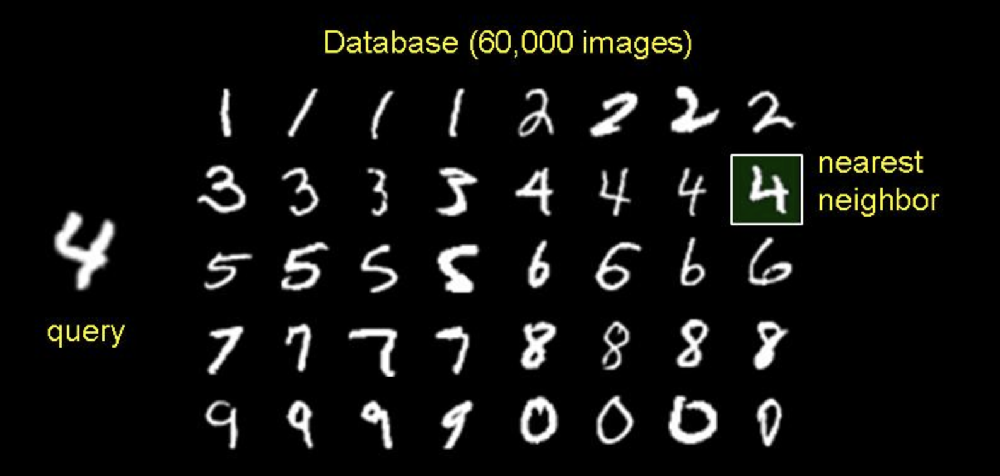

<h1>Nearest Neighbour Classifier using VP Tree</h1>

This is an efficient Nearest Neighbour Classifier for classifying images of handwritten digit from the MNIST dataset. It uses a VP Tree to pre-process the images, thus reducing query time complexity. This project was done as part of the Data Structures & Algorithms course at IIT Delhi.

<h2 id="intro">Introduction</h2>

<figure>
    
</figure>

    Classification is a fundamental task in Machine Learning. Given a labelled dataset of points and their classes, classification essentially involved using this dataset to identify the class for each query point. Classification tasks, in general can involve more than two classes as well (multi-class classification). This project, for example involves 10 classes (digits 0-9).

<h2 id="dataset"> Dataset </h2>

    The MNIST dataset <a href="http://yann.lecun.com/exdb/mnist/">(http://yann.lecun.com/exdb/mnist/)</a> has been a landmark dataset in Machine Learning and Pattern Recognition. It consists of more than 70,000 grayscale images of handwritten numeric digit, divided into a train set (of 60,000 images) and a test dataset (10,000 images). Each image has a fixed dimension of 28x28 pixels. Each image comes labelled with one of the 10 possible classes (0-9).
    Over the years this dataset has been used for testing many Convolutional Neural Networks and algorithms Machine Learning and Computer Vision.

<h2 id="acknowledgement">Acknowledgement</h2>

I referred the following research papers, articles and course lectures while working on this project-

<ul>
    <li> http://web.cs.iastate.edu/~honavar/nndatastructures.pdf </li>
    <li> http://stevehanov.ca/blog/?id=130 </li>
    <li> https://en.wikipedia.org/wiki/Vantage-point_tree </li>
    <li> https://www.cs.toronto.edu/~urtasun/courses/CSC411_Fall16/05_nn.pdf </li>
    <li> https://en.wikipedia.org/wiki/K-nearest_neighbors_algorithm </li>
    <li> https://courses.cs.washington.edu/courses/cse373/02au/lectures/lecture22l.pdf </li>
    <li> http://vlm1.uta.edu/~athitsos/nearest_neighbors/ </li>
</ul>
